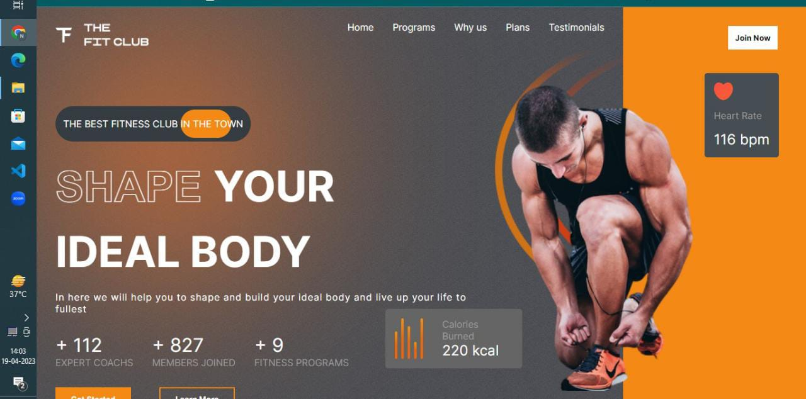
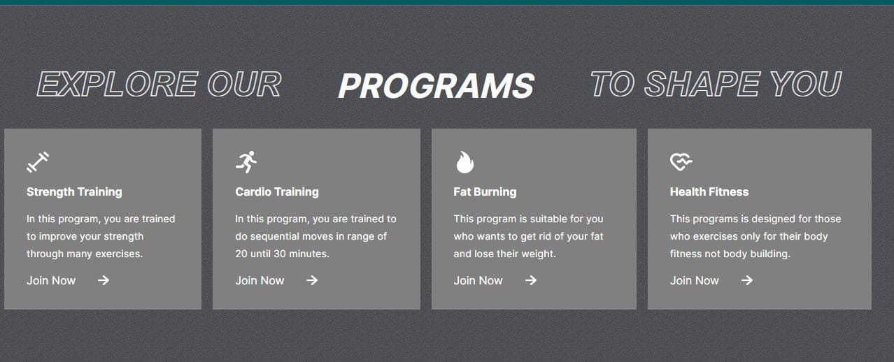
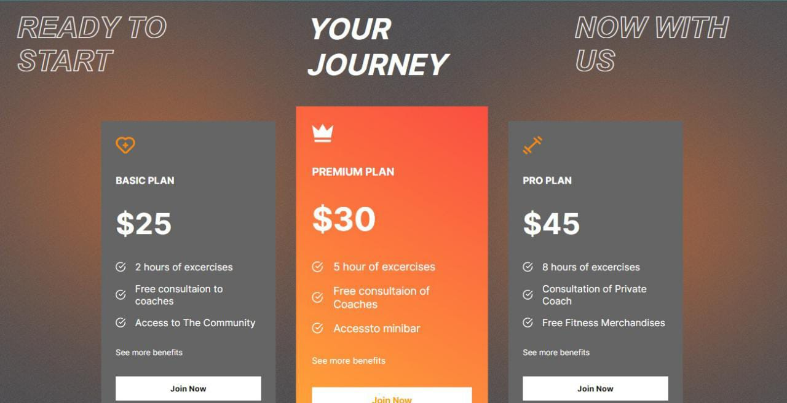
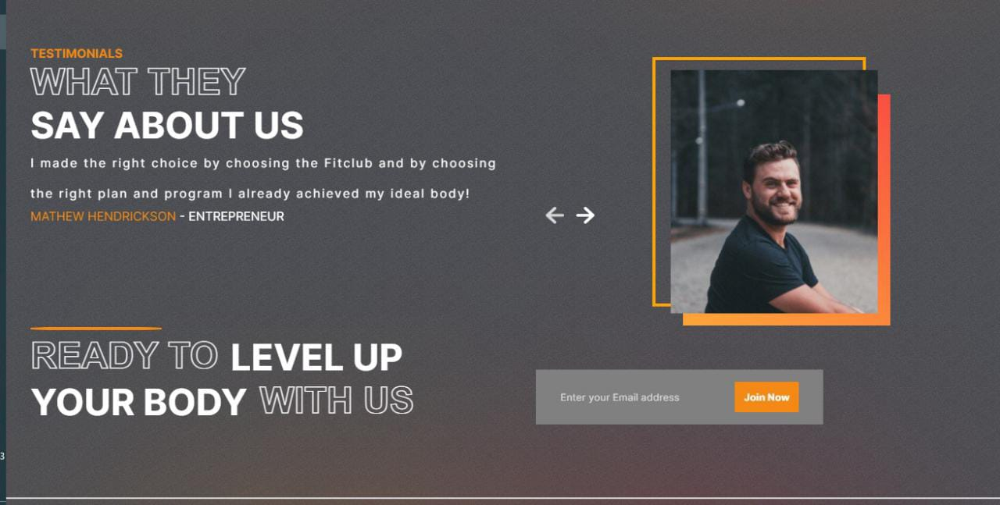
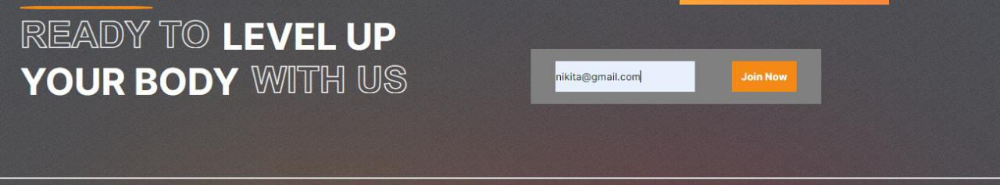
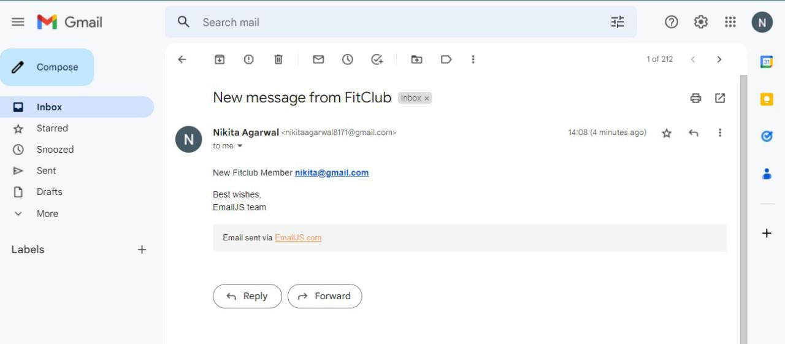

<h1 align="center">Gym Fit Club Application</h1>
<h3 align="center">This project is built to showcase my technical skills and web design skills </h3>
<h1 align="center">Technology Used</h1>
<ul>
<li>HTML</li>
<li>CSS</li>
<li>JavaScript</li>
<li>ReactJS</li>
</ul>
<h1 align="center">Features are</h1>
<ul>
<li>Create a navbar link using browserRouter package</li>
<li>Create a animation on home page using framer-motion package </li>
<li>Hide the scrollbar of web application using -webkit-scrollbar display none </li>
<li>Create a animation on number using number-counter package</li>
<li>Create a program section using components and get the array data using map function </li>
<li>Add a animation while clicking on arrow button to change the image of user's feedback in testimonials section</li>
<li>Can contact to the user over email, for this functionality I used emailjs/browser package </li>
<li>Responsive Web Design</li>
</ul>

## This is Home Section

## This is a program Section

## This is a plans section

## Testimonials

## This is the way we can send email

## We can receive user's emailid on gmail

